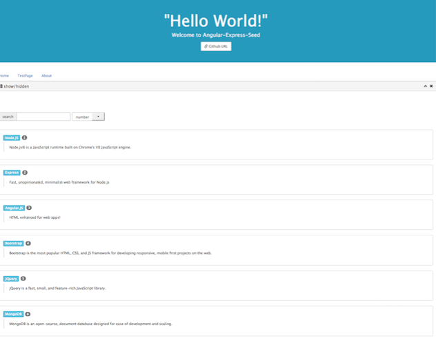

# angular-express-seed
Angular &amp; Express 种子项目框架

方便迅速搭建基于 [Angular](https://angularjs.org/) 和 [Express](http://expressjs.com/) 的Web应用项目；

## 如何使用

1. `git clone https://github.com/JiangInk/angular-express-seed.git`

2. `cd angular-express-seed/`

3. `npm install && bower install`

### 如何运行

与运行 _express_ 应用方式一致:

    ./bin/www

## 目录结构

    .
    ├── app.js
    ├── bin
    │   └── www
    ├── bower.json
    ├── package.json
    ├── public
    │   ├── images
    │   │   └── favicon.ico
    │   ├── javascripts
    │   │   └── angular
    │   │       ├── app.js
    │   │       ├── controllers.js
    │   │       ├── directives.js
    │   │       ├── filters.js
    │   │       └── services.js
    │   └── stylesheets
    │       └── style.css
    ├── routes
    │   ├── index.js
    │   └── users.js
    └── views
        ├── error.html
        ├── index.html
        └── partials
            ├── panelFunc.html
            └── testFunc.html
